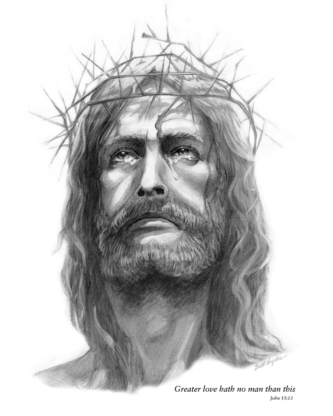
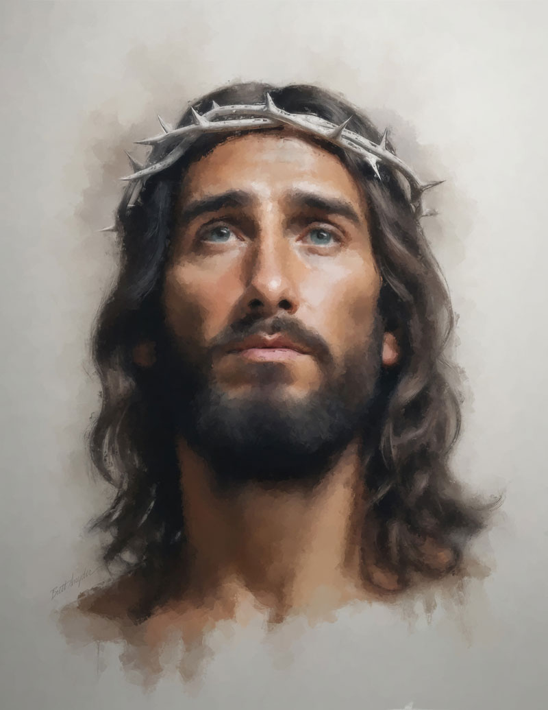
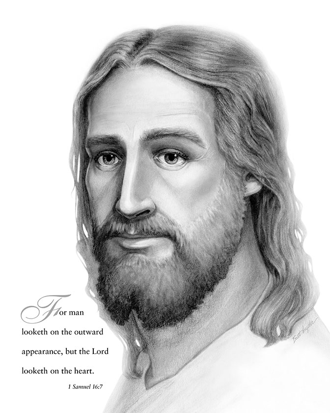
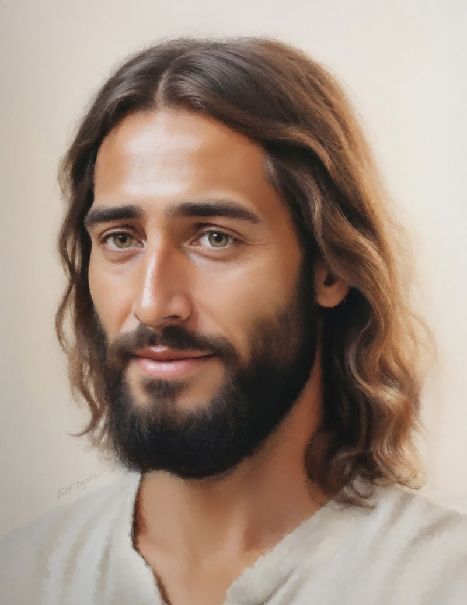

---
# BLOG METADATA - Remove comments after editing
title: "Jesus Christ Art"
description: "Original portrait series of Jesus Christ created in Photoshop between 2023-2024. This local free outreach project soon expanded to the JesusChrist.art website."
contentTitle: "Digital Composite Portrait Series"
achievementTitle: "Key Takeaways"
technologies:
  - "Prints"
  - "Website"
  - "Photoshop" 
category: "Digital Art"
status: "Completed 2024"
featured: false
readTime: "2 min read"
publishDate: "2023-06-15"
author: "Brett Snyder"
excerpt: "I used Photoshop as my canvas, locally generated AI elements, sketches, and some stock for base references. Then manually restructure and repaint."
links:
keyAchievements:
  - type: "impact"
    icon: "⚡"
    title: "Jesus Christ Art Outreach"
    description: "Locally gave away several hundred print copies. A few months later added the JesusChrist.art website so anyone could download free copies. See the website footer for dynamic analytics."
    metrics:
      - "Original Sketchs sold several thousand copies in Christian bookstores many years ago."
      - "New Portrait Series prints used by local church and missionaries. Prints, church invites, and bookmarks."
      - "8/25: 3,407 downloads • 23,590 people from 175 countries viewed 36,158 times"
      - "Zero-cost hosting, has a life beyond me"
media:
  items:
    - type: "image"
      src: "1-prince-of-peace.jpg"
      title: "Prince of Peace"
    - type: "image"
      src: "2-follow-me.jpg"
      title: "Follow Me"
    - type: "image"
      src: "3-i-know-you.jpg"
      title: "I Know You"
    - type: "image"
      src: "4-the-light.jpg"
      title: "The Light"
    - type: "image"
      src: "5-real-jesus.jpg"
      title: "Real Jesus"

---

<!-- BLOG CONTENT - Markdown body text -->

## My Digital Process

I used Photoshop as my canvas, locally generated AI elements, my sketches, and some stock as a base references. Then manually composite, restructure, and repaint. Then pass my draft through AI image to image refinement using local AI tools generated from my laptop. That output is the next round starting point to manually manipulate and repaint in Photoshop. 

Each manual round in Photoshop took several days, and crafting the image to image refinement would take a couple days. There is never direct AI output to final art as is common with online AI services. Every part of the final portrait is at usually around 30+ rounds, several weeks and months of manual evelolution in PhotoShop.

## Crown of Thorns

This sketch I did when I was 17, while preparing to go on a mission to Hong Kong. It symbolized His sacrifice for all of us. Strong neck. Bruised forehead. Blood into tears. Looking up. Resurrection. Each with a deeper meaning to me; find your own symbolism. And later a digital version called Crown of Thorns 2.

[See Jesus Christ Art site](https://www.jesuschrist.art)

## Lord Looketh

After I returned from Hong Kong, I drew this version. How Christ knows us, each of us. These sketches are just a reminder to find your own relationship with Him. Only takes a small belief, darkness fades and great things will happen. I have had so many in my life. And later a digital version called Lord Looketh 2.

[See Jesus Christ Art on Facebook ⓕ](https://www.facebook.com/61575121625003/)

## Inspiration Library

I created the Inspiration Library using Nextjs as a safe blog for sharing my favorite short inspirational stories and thoughts. It began as an extension of the message on JesusChrist.art. I decided to keep them separate to avoid overwhelming visitors. I deliberately made it text-only, no images, for easy access on phones and easy copying.

[See Inspiration Library](https://inspire.jesuschrist.art/)