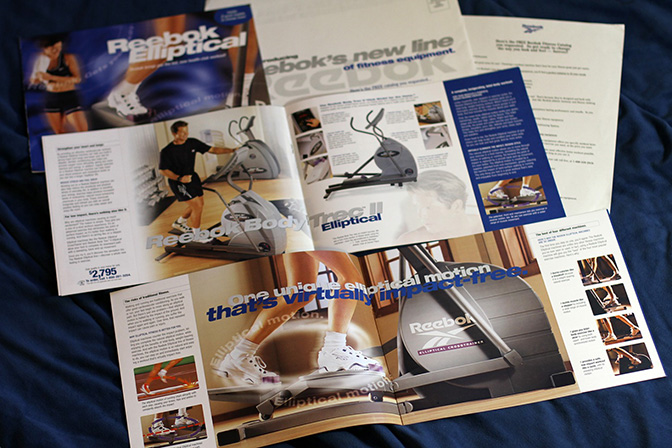

---
# PROJECT METADATA - Remove comments after editing
title: "Graphic Design"
description: "What started with catalogs, mailers, and ads naturally evolved into web and digital design—where the same principles of whitespace and simplicity now drive better engagement and conversions."
contentTitle: "Before Web, there was Print"
achievementTitle: ""
technologies:
  - "QuarkXPress"
  - "InDesign"
  - "Illustrator"
  - "Photoshop"
category: "Print"
status: "Production"
featured: false
publishDate: "2016-01-12"
links:

# KEY ACHIEVEMENTS - Cards shown on detail page
keyAchievements:
  - type: "impact"
    icon: "🌦️"
    title: "Clean Design from Print to Web"
    description: "Started in print, where I learned the value of whitespace, clarity, and strong calls to action. That style carried over naturally into web, where clean layouts and simple messaging drive better conversions."
    metrics:
      - "Evolved from catalogs, mailers, and ads to digital-first design"
      - "Focus on whitespace and readability for stronger engagement"
      - "Proven track record of turning dense content into clear stories"
      - "Hands-on experience with printers, prepress, and now web conversions"

# MEDIA - Optional additional images/videos      
media:
  items:
    - type: "image"
      src: "franklin-catalog.jpg"
      title: "Franklin Quest Catalog"
    - type: "image"
      src: "iomega-mailer.jpg"
      title: "Iomega Mailer"
    - type: "image"
      src: "reebok-brochure.jpg"
      title: "Reebok Brochure"
---

<!-- PROJECT CONTENT - Markdown body text -->

##

I remember, my daily trips to the nice Linotype lady. She would set the type for all my print projects. I would hot wax them on chromecoat for printer handoff. Or the empowerment when I borrowed my boss's Mac Plus to bypass the Linotype step by using our laser printer. Here are a few of my favorite print projects.

## Catalogs

Here is a mockup board I did for Franklin Covey. This piece stood out to me since I went for a more airy clean feel. A sharp contrast to their common dark, heavy, and cluttered look. My preference is more whitespace over dense content. I think it's easier to read and more inviting.

## Mailers

Don't you love all the direct mail you get every week? Sorry, some of that was me. The question you should always ask yourself is does the value I am presenting make it a no-brainer for the customer? If not, don't waste your time or theirs. If so, you will build brand loyalty. Here was a simple mailer for the Iomega Zip drive...and yes, new colors. Concept was nerd to a cool hipster. Crammed alot of freebies and value content in, but it worked well.

## Logos

Instead of showing all my logos, here is one. One color. Variations. Simple. Clean.

## Ads

Clean. Bright. Happy. Not too busy, single CTA. This was a full page magazine ad, sizes vary depending on the magazine.

## Brochures

Reebok wanted to show off their new ellipticals. I added motion lines and bold text. I pushed most text to the outside to allow for larger product images. I also added a few callouts to highlight the features.

Over the years, I have designed print media from newspaper, brochures, newsletters, catalogs, direct mail, magazine ads, billboards, stationery, packaging, and more. I have worked with printers and prepress houses. Been on press-checks from Hong Kong to other major cities.

